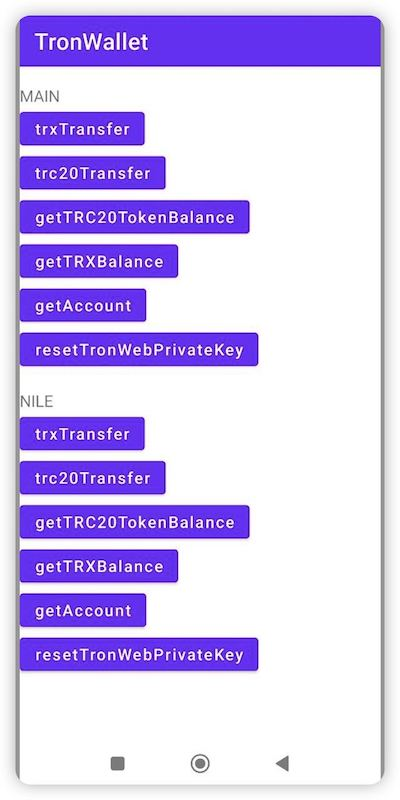

# TronWallet
**TronWallet** is an Android toolbelt for interaction with the Tron network.


[](https://www.swift.org/getting-started/#using-the-package-manager)



波场私钥、助记词、Keystore的生成，推荐使用 [TrustWalletCore](https://github.com/trustwallet/wallet-core)

For more specific usage, please refer to the [demo](https://github.com/james19870606/TronWallet/tree/master/app)

## JitPack.io

I strongly recommend https://jitpack.io
```groovy
repositories {
    ...
    maven { url 'https://jitpack.io' }
}
dependencies {
    implementation 'com.github.james19870606:TronWallet:1.0.1'
}
```

##### Setup TronWeb
```kotlin
val onCompleted = {result : Boolean ->
    println("onCompleted------->>>>>")
    println(result)
    if (action == "trxTransfer") trxTransfer() else trc20Transfer()
}
val privateKey = privateKeyEditText?.text.toString()
val node = if(position == 0) TRONMainNet else TRONNileNet
if (tronweb?.isGenerateTronWebInstanceSuccess == false) {
tronweb?.setup(true, privateKey, node = node,onCompleted = onCompleted)
} else  {
if (action == "trxTransfer") trxTransfer() else  trc20Transfer()
}
```

##### Send TRX
```Kotlin
val remark = ""
val toAddress = ""
val amount = ""
val onCompleted = {result : Boolean, txid: String ->
    this.runOnUiThread {
        println(txid)
    }
}
tronweb?.trxTransferWithOutRemark(
    toAddress ,
    amount ,
    onCompleted = onCompleted)

```
##### Send TRC20
```Kotlin
val remark = ""
val toAddress = ""
val trc20ContractAddress = ""
val amount = ""
val onCompleted = {result : Boolean, txid: String ->
    this.runOnUiThread {
         println(txid)
    }
}
tronweb?.trc20TokenTransfer(
    toAddress,
    trc20ContractAddress,
    amount,
    remark,
    onCompleted = onCompleted)
```

更详细的使用方法,建议参考 [demo](https://github.com/james19870606/TronWallet/tree/master/app)

## License

TronWeb is released under the MIT license. [See LICENSE](https://github.com/james19870606/TronWallet/LICENSE) for details.
