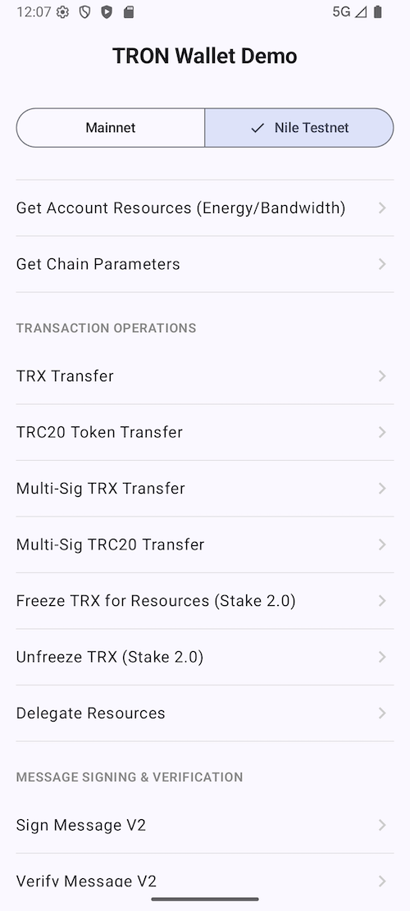

# TronWallet
**TronWallet** is an Android toolbelt for interaction with the Tron network.


[]



For more specific usage, please refer to the [demo](https://github.com/james19870606/TronWallet/tree/master/app)

## JitPack.io

I strongly recommend https://jitpack.io
```groovy
repositories {
    ...
    maven { url 'https://jitpack.io' }
}
dependencies {
    implementation 'com.github.james19870606:TronWallet:1.1.4'
}
```
# TronWeb Android SDK Usage Guide

This guide provides example code for integrating the TronWeb Android SDK into your Kotlin-based Android applications. The SDK supports both callback-based and Coroutine-based asynchronous operations.

## 1. Setup & Initialization

First, initialize the `TronWeb` instance with a network node and an optional API key.

```kotlin
val tronWeb = TronWeb(context)

// Asynchronous setup using Coroutines
lifecycleScope.launch {
    val (success, error) = tronWeb.setupAsync(
        node = TronWeb.TRON_NILE_NET, // Or TronWeb.TRON_MAINNET
        apiKey = "your-api-key"
    )
    
    if (success) {
        Log.d("TronWeb", "Initialization successful")
    } else {
        Log.e("TronWeb", "Initialization failed: $error")
    }
}
```

## 2. Wallet Management

### Create Random Wallet
```kotlin
val response = tronWeb.createRandomAsync(wordCount = 12, language = "english")
// Returns mnemonic, privateKey, publicKey, address
```

### Import Account from Mnemonic
```kotlin
val mnemonic = "word1 word2 ..."
val response = tronWeb.importAccountFromMnemonicAsync(mnemonic)
```

### Import Account from Private Key
```kotlin
val privateKey = "your-private-key"
val response = tronWeb.importAccountFromPrivateKeyAsync(privateKey)
```

### Create Multi-Sig Address
```kotlin
val owners = listOf("Address1", "Address2")
val response = tronWeb.createMultiSigAddressAsync(
    ownerAddress = "YourAddress",
    owners = owners,
    required = 2,
    privateKey = "YourPrivateKey"
)
```

## 3. Account Query

### Get Account Details
```kotlin
val response = tronWeb.getAccountAsync("Address")
// Returns full account info from blockchain
```

### Get TRX Balance
```kotlin
val response = tronWeb.getTRXBalanceAsync("Address")
// response["balance"] contains TRX amount
```

### Get TRC20 Token Balance
```kotlin
val response = tronWeb.getTRC20TokenBalanceAsync(
    contractAddress = "TR7NHqjeKQxGChDe8n9u6616v4ALny7nv8", // USDT
    address = "TargetAddress"
)
```

### Get Account Resources (Energy/Bandwidth)
```kotlin
val response = tronWeb.getAccountResourcesAsync("Address")
```

### Get Chain Parameters
```kotlin
val response = tronWeb.getChainParametersAsync()
// Returns network parameters like proposal details
```

## 4. Message Signing & Verification

### Sign Message (TIP-191)
```kotlin
val response = tronWeb.signMessageV2Async("Hello TRON", "PrivateKey")
// Returns signature hex
```

### Verify Message
```kotlin
val response = tronWeb.verifyMessageV2Async(
    message = "Hello TRON",
    signature = "SignatureHex",
    address = "ExpectedAddress"
)
// Returns boolean state
```

## 5. Transaction Operations (Single-Sig)

### TRX Transfer
```kotlin
val response = tronWeb.trxTransferAsync(
    toAddress = "ReceiverAddress",
    amount = 1.0, // 1 TRX
    privateKey = "SenderPrivateKey",
    remark.trim().ifEmpty { null }
)
```

### TRC20 Token Transfer
```kotlin
val response = tronWeb.trc20TransferAsync(
    contractAddress = "TokenContractAddress",
    toAddress = "ReceiverAddress",
    amount = 10.0,
    privateKey = "SenderPrivateKey",
    remark.trim().ifEmpty { null }
)
```

### Estimate Fees
```kotlin
// Estimate TRX Transfer Fee
val trxFee = tronWeb.estimateTrxFeeAsync("To", 1.0, "From")

// Estimate TRC20 Transfer Fee
val trc20Fee = tronWeb.estimateTrc20FeeAsync("Contract", "To", 10.0, "From")
```

## 6. Multi-Sig Operations

### Multi-Sig TRX Transfer
```kotlin
val response = tronWeb.multiSigTrxTransferAsync(
    fromAddress = "MultiSigAddress",
    toAddress = "ReceiverAddress",
    amount = 1.0,
    privateKeys = listOf("Key1", "Key2"), // Enough keys to satisfy weight
    permissionId = 2, // Usually 2 for Active permission
    remark.trim().ifEmpty { null }
)
```

### Estimate Multi-Sig Fees
```kotlin
val fee = tronWeb.estimateMultiSigTrxFeeAsync(
    fromAddress = "MultiSigAddress",
    toAddress = "To",
    amount = 1.0,
    privateKeysCount = 2
)
```

## 7. Resource Staking (Stake 2.0)

### Freeze TRX for Energy/Bandwidth
```kotlin
val response = tronWeb.freezeBalanceAsync(
    amount = 100.0,
    resourceType = "ENERGY", // or "BANDWIDTH"
    privateKey = "YourPrivateKey"
)
```

### Unfreeze TRX
```kotlin
val response = tronWeb.unfreezeBalanceAsync(
    amount = 100.0,
    resourceType = "ENERGY",
    privateKey = "YourPrivateKey"
)
```

### Delegate Resource to Another Address
```kotlin
val response = tronWeb.delegateResourceAsync(
    amount = 50.0,
    resourceType = "ENERGY",
    receiverAddress = "ReceiverAddress",
    privateKey = "YourPrivateKey"
)
```

---

## Error Handling

All `Async` methods return a `Map<String, Any>?`. You can check the `state` or `error` field in the response:

```kotlin
val response = tronWeb.getTRXBalanceAsync(address)
if (response != null) {
    val state = response["state"] as? Boolean ?: false
    if (state) {
        val balance = response["balance"]
        Log.d("TronWeb", "Balance: $balance")
    } else {
        val error = response["error"] as? String ?: "Unknown error"
        Log.e("TronWeb", "Error: $error")
    }
}
```


## License

TronWeb is released under the MIT license. [See LICENSE](https://github.com/james19870606/TronWallet/blob/master/LICENSE) for details .
