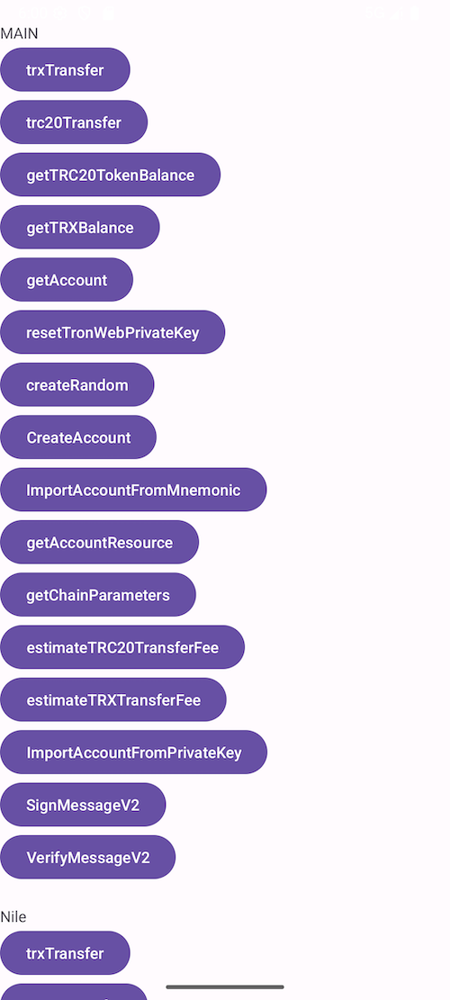

# TronWallet
**TronWallet** is an Android toolbelt for interaction with the Tron network.


[]



For more specific usage, please refer to the [demo](https://github.com/james19870606/TronWallet/tree/master/app)

## JitPack.io

I strongly recommend https://jitpack.io
```groovy
repositories {
    ...
    maven { url 'https://jitpack.io' }
}
dependencies {
    implementation 'com.github.james19870606:TronWallet:1.0.8'
}
```

##### Setup TronWeb 
```kotlin
val onCompleted = {result : Boolean,error : String ->
   //......
}
val privateKey = ""

val node = if(position == 0) TRONMainNet else TRONNileNet

if (tronweb?.isGenerateTronWebInstanceSuccess == false) {

  tronweb?.setup(true, privateKey, node = node,onCompleted = onCompleted)

} else  {

}
```
##### Create Random
```Kotlin
val onCompleted = {state: Boolean, address: String, privateKey: String, publicKey: String, mnemonic: String, error: String ->
       runOnUiThread {
        val text = """
            address: $address

            mnemonic: $mnemonic

            privateKey: $privateKey

            publicKey: $publicKey
        """
        walletDetail?.setText(if (state) text else error)
    }    
  }
tronweb?.createRandom(onCompleted = onCompleted)
```

##### Create Account
```Kotlin
val onCompleted = { state: Boolean, hexAddress: String, base58Address: String, privateKey: String, publicKey: String, error: String ->
  runOnUiThread {
            val text = """
                hexAddress: $hexAddress
    
                base58Address: $base58Address
    
                privateKey: $privateKey
    
                publicKey: $publicKey
            """
            walletDetail?.setText(if (state) text else error)
     }
}
tronweb?.createAccount(onCompleted = onCompleted)
```
##### Import Account From Mnemonic
```Kotlin
val mnemonic = mnemonicEditText?.getText().toString();
val onCompleted = { state: Boolean, address: String, privateKey: String, publicKey: String, error: String ->
     runOnUiThread {
            val text = """
                address: $address
    
                privateKey: $privateKey
    
                publicKey: $publicKey
            """
            walletDetail?.setText(if (state) text else error)
        }
}
tronweb?.importAccountFromMnemonic(mnemonic, onCompleted = onCompleted)
```
##### Send TRX
```Kotlin
val onCompleted = {state : Boolean, txid: String ,error:String->
    this.runOnUiThread {
        if (state){
            hashValue?.text = txid
        } else {
            hashValue?.text = error
        }
    }
}
tronweb?.trxTransferWithOutRemark(
    toAddress ,
    amount ,
    onCompleted = onCompleted)

```
##### Send TRC20
```Kotlin
val onCompleted = {state : Boolean, txid: String,error:String ->
    this.runOnUiThread {
        if (state){
            hashValue?.text = txid
        } else {
            hashValue?.text = error
        }
    }
}
tronweb?.trc20TokenTransfer(
    toAddress,
    trc20ContractAddress,
    amount,
    remark,
    onCompleted = onCompleted)
```

##### Fee Estimate When Send TRC20
```Kotlin
val onCompleted = {state : Boolean, energyUsed:Double,energyFee:Double,error:String ->
    this.runOnUiThread {
        if (state){
            val trxFee =  (energyUsed * energyFee) / 1_000_000
            hashValue?.text =
                "Resource Consumed  339 Bandwidth $energyUsed Energy\nFee    $trxFee TRX"
        } else {
            hashValue?.text = error
        }
    }
}
val url = if(position == 0) TRONMainNet else TRONNileNet
tronweb?.getFeeEstimate(
    url,
    toAddress,
    trc20ContractAddress,
    amount,
    onCompleted = onCompleted)
```

更详细的使用方法,建议参考 [demo](https://github.com/james19870606/TronWallet/tree/master/app)

## License

TronWeb is released under the MIT license. [See LICENSE](https://github.com/james19870606/TronWallet/blob/master/LICENSE) for details.
